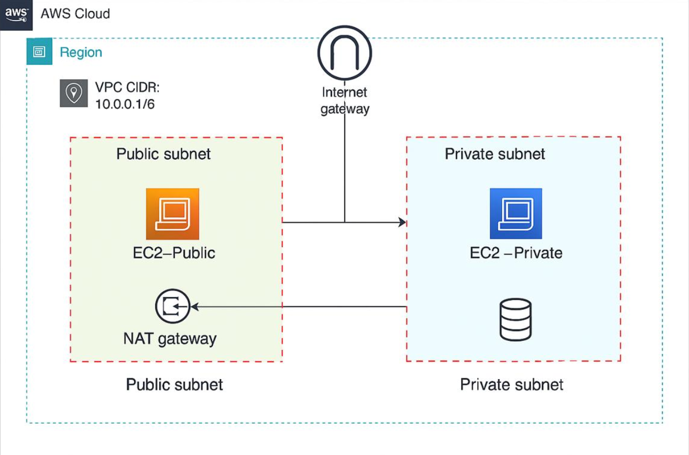
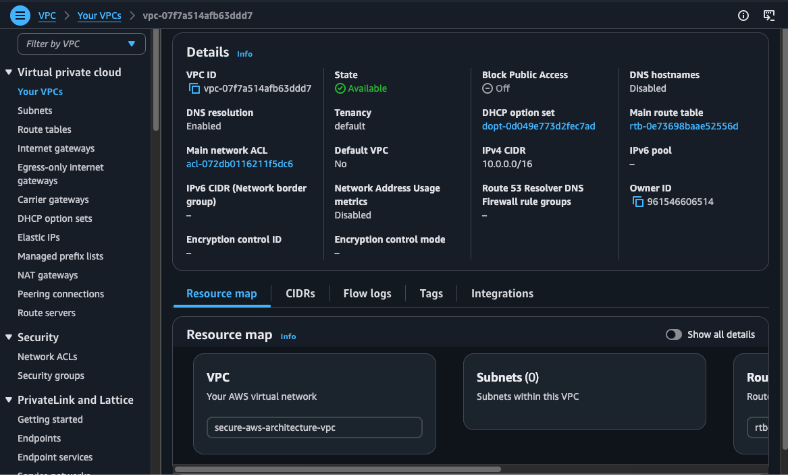
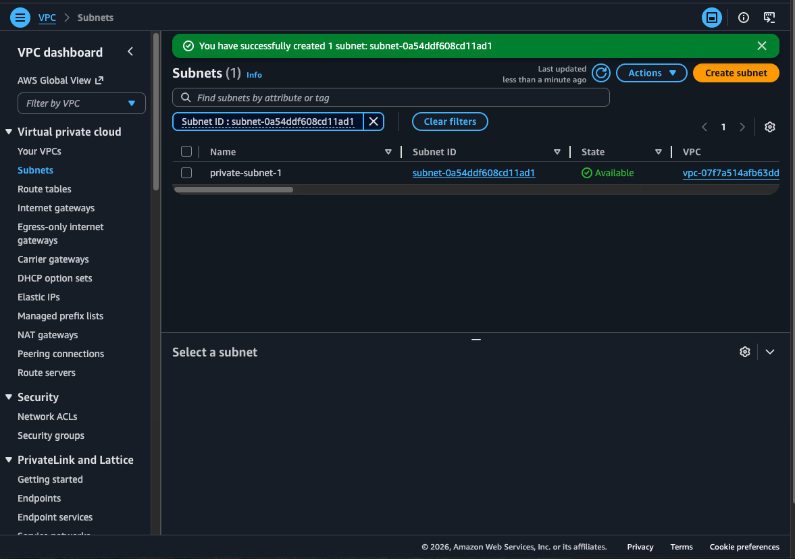
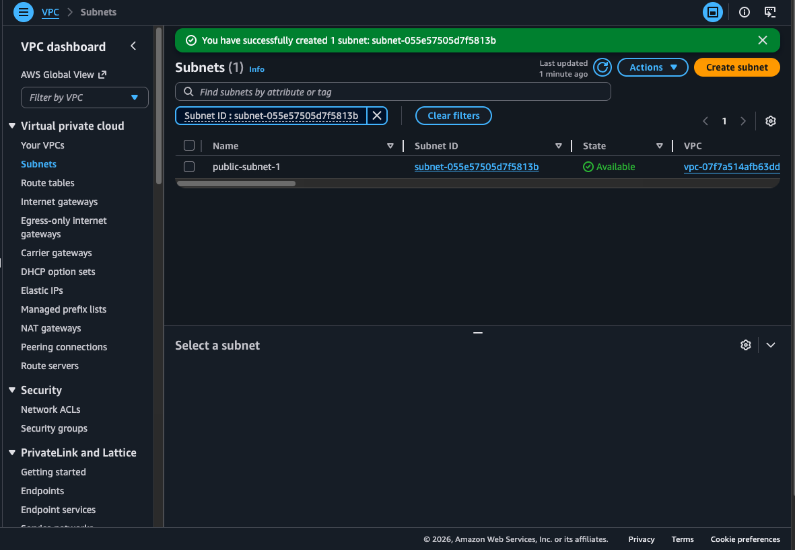
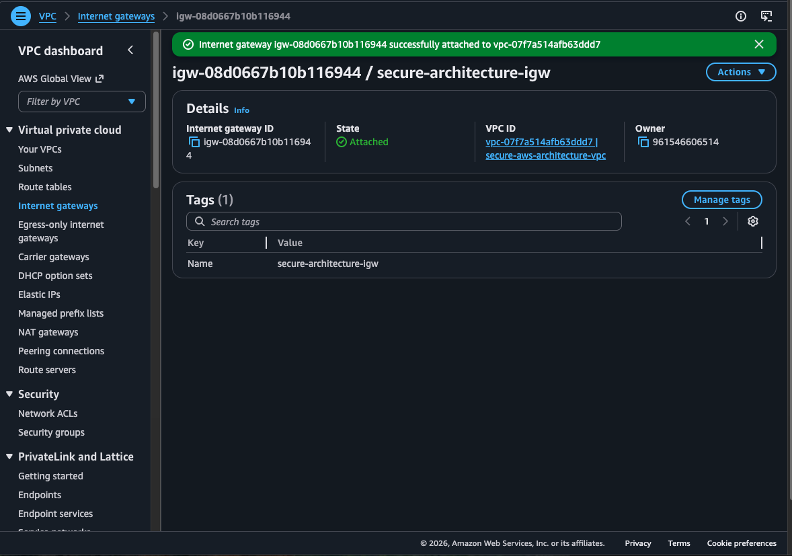
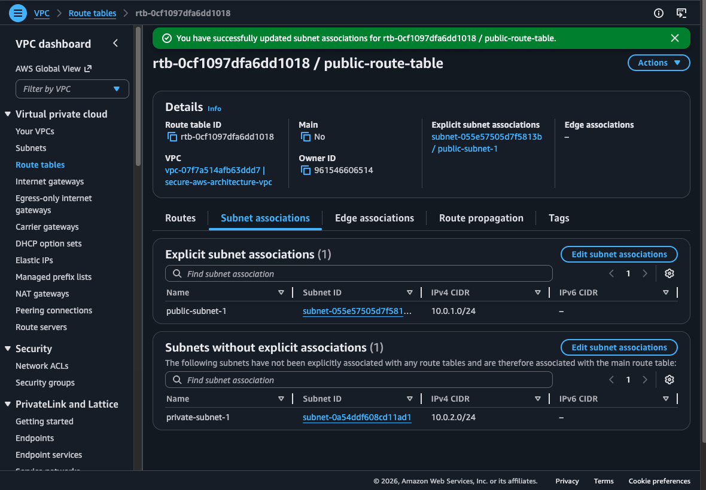
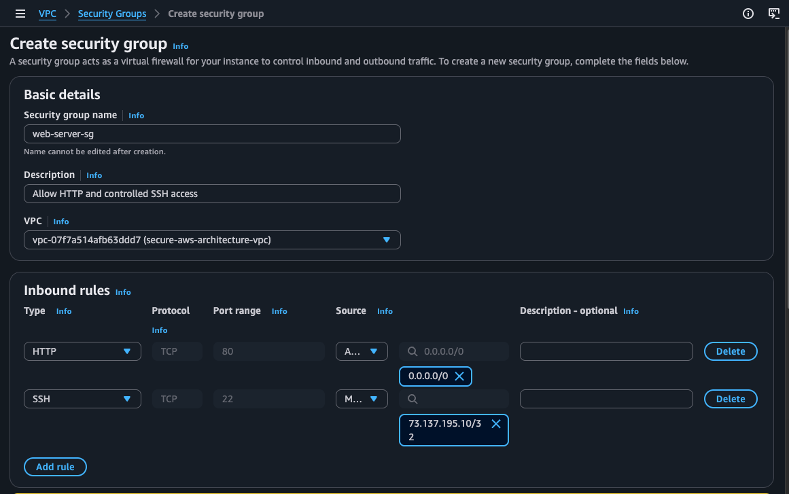
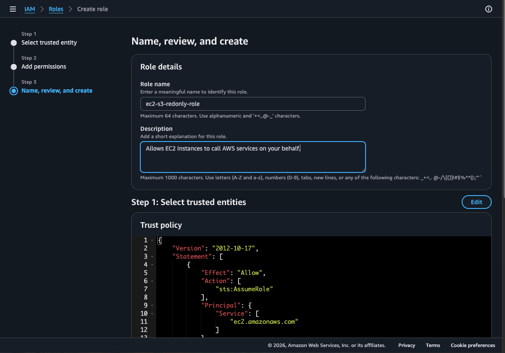
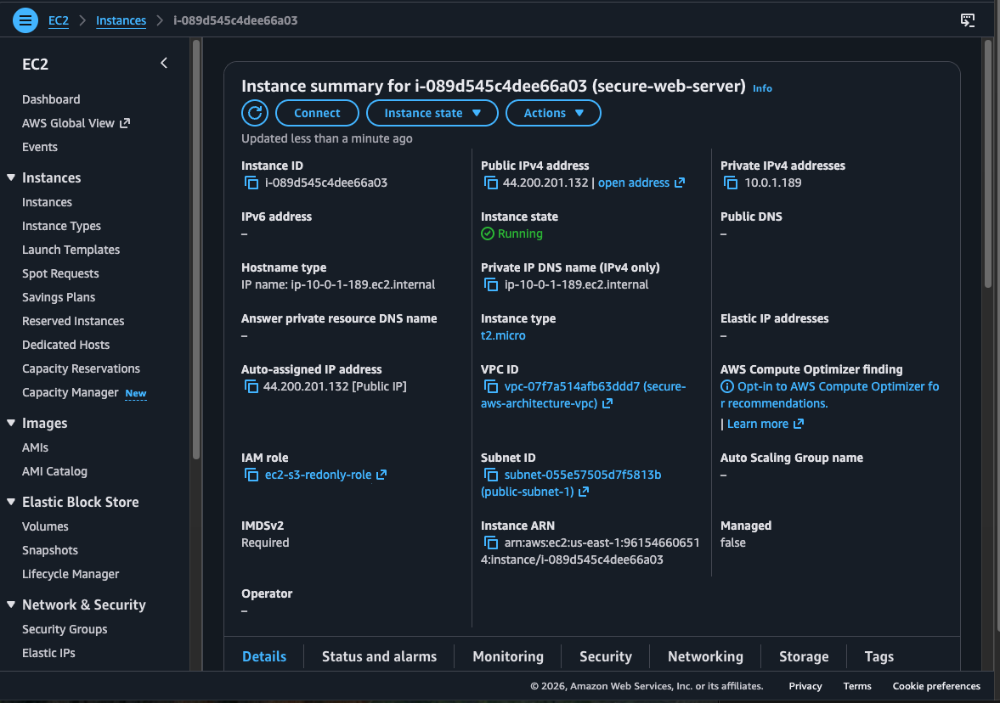
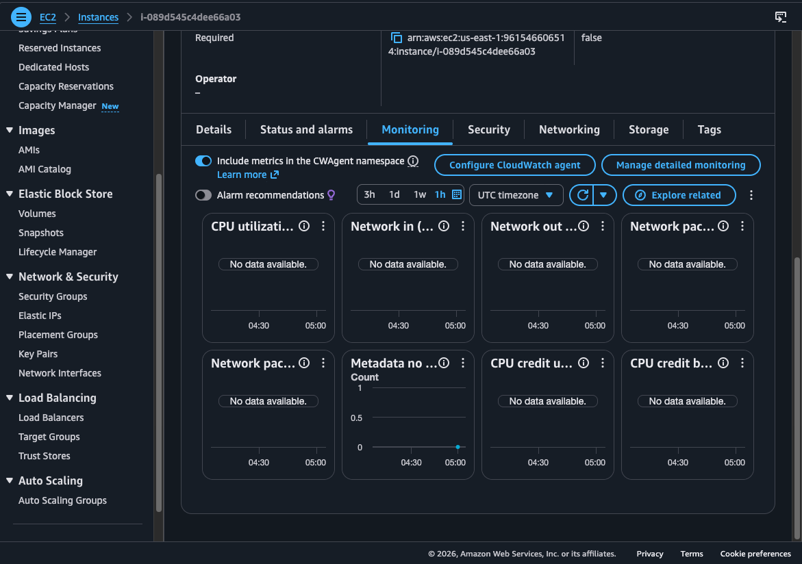

# AWS Secure Cloud Architecture

## Project Overview
This project demonstrates a secure AWS cloud architecture designed using AWS networking, IAM, and monitoring services.

Key components include:
- Custom VPC
- Public and Private Subnets
- Internet Gateway
- Route Tables
- Security Groups
- IAM Role
- EC2 Instance
- CloudWatch Monitoring

---

## Architecture Diagram

---

## Step 1: Create VPC

Created a dedicated VPC with CIDR block `10.0.0.0/16` to isolate cloud resources.

---

## Step 2: Configure Subnets

### Private Subnet

### Public Subnet

Public subnet hosts internet-facing resources while private subnet protects internal resources.

---

## Step 3: Attach Internet Gateway

The Internet Gateway enables internet access for public resources.

---

## Step 4: Configure Route Table

Associated only the public subnet with the internet route.

---

## Step 5: Create Security Group

Security group allows:
- HTTP (Port 80) from anywhere
- SSH (Port 22) only from my IP

---

## Step 6: Configure IAM Role

Attached AmazonS3ReadOnlyAccess using least-privilege access principles.

---

## Step 7: Launch EC2 Instance

Deployed EC2 inside the public subnet with security controls applied.

---

## Step 8: Monitoring with CloudWatch

CloudWatch provides monitoring and operational visibility.

---

## Skills Demonstrated
- AWS VPC
- IAM
- EC2
- Security Groups
- Cloud Security
- Network Segmentation
- Cloud Monitoring

## Video Walkthrough

Watch the full project walkthrough here:
[Loom Demo Video](https://www.loom.com/share/30786d6f42d44e9bb1dac7c188a1e26a)
